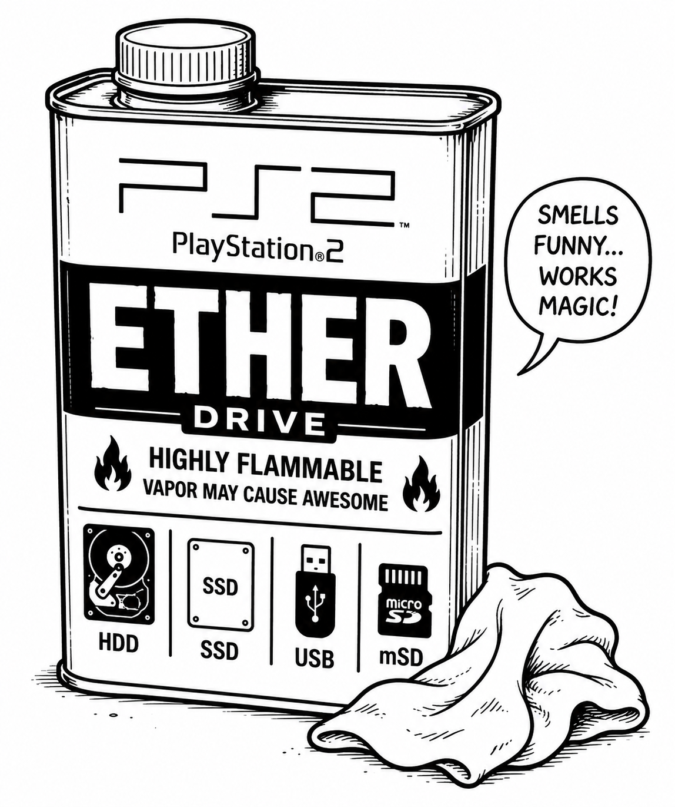

  <picture>
    <source media="(prefers-color-scheme: dark)" srcset="Images/Logos/FBD-PS2-EtherDrive-Logo-Dark.png">
    <source media="(prefers-color-scheme: light)" srcset="Images/Logos/FBD-PS2-EtherDrive-Logo.png">
    
  </picture>

# PS2-EtherDrive

PS2-EtherDrive is a custom internal networking and storage platform for the PlayStation 2 Slim.

The goal of the project is to modernize PS2 network functionality by integrating a compact OpenWrt-based router and storage platform directly inside the console while still retaining physical Ethernet support through the original network port.

This project is primarily focused on later PS2 Slim models where native internal HDD-style solutions are not available.

[Open the EtherDrive WebUI Preview](https://fatbalddad.github.io/PS2-EtherDrive/WebUI-Preview/)

## Internal EtherDrive System Breakdown

The internal EtherDrive base design is focused on PS2 Slim 70k to 77k models.  
This version uses the HLK-7628N as the internal OpenWrt router/storage controller, direct microSD storage over SDIO, and a WebUI as the primary control interface.

The internal base version does not require a touchscreen, USB hub, or external display. Those features are treated as optional expansion features for later external or premium versions.

```mermaid
flowchart TB

    ROOT["Internal EtherDrive<br/>Base System<br/>PS2 Slim 70k to 77k"]

    ROOT --> HW["Hardware<br/>70k to 77k PS2 Slim"]
    ROOT --> PWR["Power System"]
    ROOT --> CORE["Router Core"]
    ROOT --> STORAGE["Storage System"]
    ROOT --> ETH["Ethernet System"]
    ROOT --> UI["User Interface"]
    ROOT --> FW["Firmware and Services"]

    HW --> HW1["PS2 Slim motherboard"]
    HW --> HW2["Original RJ45 port"]
    HW --> HW3["Ethernet PHY side pads"]
    HW --> HW4["Internal mounting area"]
    HW --> HW5["Clean OEM style install"]

    PWR --> PWR1["PS2 8.5V input"]
    PWR --> PWR2["Input protection"]
    PWR --> PWR3["5V rail if needed"]
    PWR --> PWR4["3.3V rail for HLK module"]
    PWR --> PWR5["3.3V rail for microSD"]

    CORE --> CORE1["HLK-7628N module"]
    CORE --> CORE2["MT7628N SoC"]
    CORE --> CORE3["OpenWrt base firmware"]
    CORE --> CORE4["WiFi AP client bridge"]
    CORE --> CORE5["10/100 Ethernet interface"]

    STORAGE --> ST1["microSD socket"]
    STORAGE --> ST2["SDIO connection"]
    STORAGE --> ST3["Game storage"]
    STORAGE --> ST4["Config storage"]
    STORAGE --> ST5["WebUI files"]
    STORAGE --> ST6["Update files"]

    ETH --> ETH1["Original PS2 RJ45 reused"]
    ETH --> ETH2["Cable side magnetics"]
    ETH --> ETH3["HLK Ethernet port"]
    ETH --> ETH4["PS2 side magnetics"]
    ETH --> ETH5["Back to PS2 Ethernet pads"]

    UI --> UI1["WebUI primary control"]
    UI --> UI2["Network setup"]
    UI --> UI3["Storage setup"]
    UI --> UI4["Service mode selection"]
    UI --> UI5["Status and diagnostics"]

    FW --> FW1["UDPBD or UDPFS support"]
    FW --> FW2["SMB optional mode"]
    FW --> FW3["FTP optional mode"]
    FW --> FW4["Firmware update support"]
    FW --> FW5["Fallback stable firmware"]

    classDef root fill:#020617,stroke:#38bdf8,color:#f8fafc,stroke-width:3px;
    classDef category fill:#0f172a,stroke:#60a5fa,color:#f8fafc,stroke-width:2px;
    classDef hardware fill:#1e1b4b,stroke:#a78bfa,color:#f8fafc,stroke-width:1px;
    classDef power fill:#422006,stroke:#facc15,color:#f8fafc,stroke-width:1px;
    classDef core fill:#082f49,stroke:#38bdf8,color:#f8fafc,stroke-width:1px;
    classDef storage fill:#052e16,stroke:#22c55e,color:#f8fafc,stroke-width:1px;
    classDef ethernet fill:#172554,stroke:#818cf8,color:#f8fafc,stroke-width:1px;
    classDef ui fill:#312e81,stroke:#c084fc,color:#f8fafc,stroke-width:1px;
    classDef firmware fill:#1f2937,stroke:#94a3b8,color:#f8fafc,stroke-width:1px;

    class ROOT root;
    class HW,PWR,CORE,STORAGE,ETH,UI,FW category;
    class HW1,HW2,HW3,HW4,HW5 hardware;
    class PWR1,PWR2,PWR3,PWR4,PWR5 power;
    class CORE1,CORE2,CORE3,CORE4,CORE5 core;
    class ST1,ST2,ST3,ST4,ST5,ST6 storage;
    class ETH1,ETH2,ETH3,ETH4,ETH5 ethernet;
    class UI1,UI2,UI3,UI4,UI5 ui;
    class FW1,FW2,FW3,FW4,FW5 firmware;
```

## Project Goals

- Add internal network storage functionality to compatible PS2 Slim consoles
- Support SMB and UDPBD/UDPFS-style network loading workflows
- Provide WiFi bridge functionality
- Retain use of the original PS2 Ethernet port
- Support internal USB or microSD-based storage options
- Keep installation as clean and OEM-like as possible
- Build a documented and repeatable kit-style solution

## Current Status

This project is currently in early development.

Hardware, firmware, installation methods, and compatibility information are subject to change as prototypes are designed, tested, and revised.

## Planned Features

- HLK-7628N based internal router platform
- OpenWrt-based firmware
- SMB support
- UDPBD/UDPFS support
- WiFi client bridge support
- Internal storage support
- PS2 Ethernet passthrough design
- Power regulation from the PS2 internal power system
- Installation documentation
- Recovery and firmware update notes
- Compatibility testing

## Additional Features (Future)

- General-purpose usage mode with the ability to store and share other file types on your home network.
- MMCE microSD card setup option that can prepare a formatted microSD card for use with MMCE, including preconfigured EtherDrive files or card images.
- Optional MMCE setup selections for other consoles or MMCE-compatible devices.
- MMCE firmware/update support from SD2PSXTD GitHub when internet access is available.
- Built-in fallback to the last stable release if internet access is not available or an update fails.
- Optional DIY build versions, including PS2 trimmed-shell builds or “Can of ETHER” themed external builds.
- Firmware builds for other compatible router platforms using the same general WebUI with hardware-specific options.

## Repository Purpose

This repository is used for:

- Project documentation
- Development notes
- Hardware planning
- Firmware notes
- Test results
- Installation research
- Community feedback
- Issue tracking
- Future firmware releases

## Important Notice

Gerber files, production hardware files, and firmware source files are not currently included in this repository.

This project is intended to become a future FBD kit/product. Public documentation will be expanded as the project matures, but manufacturing files may remain private until design and production costs have been recovered.

## Documentation

- [Docs](Docs/README.md)
- [Hardware](Hardware/README.md)
- [Firmware](Firmware/README.md)
- [References](References/README.md)
- [Test Data](Test-Data/README.md)
- [Manufacturing](Manufacturing/README.md)
- [WebUI Preview](WebUI-Preview/index.html)

GitHub Pages can be enabled to preview the static WebUI in a browser at `WebUI-Preview/index.html`.

## Compatibility

Initial development is focused on PlayStation 2 Slim consoles, especially later Slim models where traditional internal HDD-style solutions are not practical.

Compatibility will be updated as testing progresses.

## Support and Feedback

Use GitHub Issues for:

- Bug reports
- Compatibility notes
- Installation feedback
- Documentation corrections
- Feature requests

Use GitHub Discussions for:

- General project discussion
- Ideas
- Community testing
- Installation questions

## Project Status

Experimental / In Development

## Created By

Fat Bald Dad / FBD Retro Game

## AI Assistance and Attribution Disclaimer

This project uses AI tools to help with writing, organization, documentation, research, code examples, and design planning. While I review and edit the information, some details may still be incorrect, incomplete, or outdated.

Not all ideas, code, research, methods, or technical information in this project should be credited only to me. This project may reference, build on, or be inspired by community knowledge, open-source projects, datasheets, forum posts, Discord discussions, manufacturer documentation, and the work of other developers and modders.

Credit will be given whenever a source is known. If something is missing credit or needs correction, please let me know so I can update the documentation.
